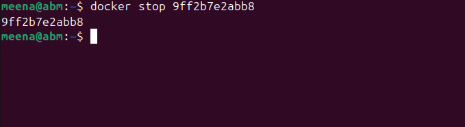

# Introduction_To_Docker 

# What are Containers?

Containers are lightweight, portable units that package an application and all its dependencies (libraries, configuration files, runtime, etc.) into a single standardized unit. This ensures that the application runs consistently across different environments — from a developer’s laptop to testing, staging, and production servers.

Unlike virtual machines (VMs), containers share the host operating system’s kernel, making them faster and more resource-efficient.

# Advantages of Containers

1. Portability Across Environments

Applications run consistently across different systems (developer laptops, on-prem servers, cloud).

Eliminates the “works on my machine” problem.

2. Resource Efficiency Compared to Virtual Machines

Containers share the host OS kernel, avoiding the overhead of running multiple full operating systems.

This makes them lighter, faster to start, and capable of running more workloads on the same hardware.

3. Rapid Application Deployment and Scaling

Containers can be started or stopped in seconds.

Easy to scale applications up/down using container orchestration tools (e.g., Kubernetes, Docker Swarm).

Supports microservices architecture by isolating services.

# Getting Started With Docker .

we needto launch a latest updated Ubuntu instance and connect to it .

Before installing docker Engine for the first time , it is necessary to configure the docker repository . Following this setup , we can proceed to install and update docker directly from the repository .

1. sudo apt update ; this is s linux command that rafresh the package list on a debian-based system , ensuring the latest software information is available for installation.

.

2. sudo apt-get install ca-certificates curl gnupg: This a linux command that install essential package including certificate authorities , data transfer tools (curl) and the GNU privacy guard for secure communication and package verification . 

.

3. sudo install -m 0755 -d /etc/apt/keyrings : this command creates directory with specific permission for storing keyrings file which are use for docker authentication.

4. curl -fsSL http://download.docker.com/linux/ubuntu/gpg | sudo gpg --dearmor -o /etc/apt/keyrings/docker.gpg : this download the docker GPG key using curl.

5. sudo chmod a+r /etc/apt/keyrings/docker.gpg: This set read permissions for all users on the docker gpg key file within the APT keyring directory,

## Lats Add The repository to Apt Sources 

echo \
  "deb [arch=$(dpkg --print-architecture) signed-by=/etc/apt/keyrings/docker.gpg] https://download.docker.com/linux/ubuntu \
  $(. /etc/os-release && echo "$VERSION_CODENAME") stable" | \
  sudo tee /etc/apt/sources.list.d/docker.list > /dev/null

"The "echo" command creates a Docker APT repository configuration entry for the Ubuntu system, incorporating the system architecture and Docker GPG key, and then "sudo tee /etc/apt/sources.list.d/docker.list > /dev/null" writes this configuration to the "/etc/apt/sources.list.d/docker.list" file."

1. update the software : sudo apt-get update 

2. install latest version of docker: sudo apt-get install docker-ce docker-ce-cli containerd.io docker-buildx-plugin docker-compose-plugin
.

3. verify that docker has been successfully installed. 

.

By default after installing docker , it can only be run by root user or using sudo command . To run docker command without sudo execute the this command 
" sudo usermod -aG docker meena

After executing the command we can run docker without using superuser priviledges.

## Running The "Hello World " container 
Using the docker run command 

The docker run command is the entry point to execute containers in Docker. It allows you to create and start a container based on a specified Docker image. The most straightforward example is the "Hello World" container, a minimalistic container that prints a greeting message when executed.

When you run "docker run hello-world" and you see someting like this , means everything is working correctly.

.

When you execute this command, Docker performs the following steps:

1. Pulls Image (if not available locally): Docker checks if the hello-world image is available locally. If not, it automatically pulls it from the Docker Hub, a centralized repository for Docker images.

2. Creates a Container: Docker creates a container based on the hello-world image. This container is an instance of the image, with its own isolated filesystem and runtime environment.

3. Starts the Container: The container is started, and it executes the predefined command in the hello-world image, which prints a friendly message.

# Unserdtanding Docker Image and Container lifecycle.

## What is a Docker Image?

A Docker image is a read-only template that contains everything needed to run a container:

- Application code

- Runtime (like Python, Java, Node.js)

- Libraries and dependencies

- Environment variables and configuration

 A Docker container goes through several states from creation to removal. Once cntainer is created from an image it can be : started, stopped and restart.

 ## Verifying the successfull execution 
 you can check if the image is now in your local environment with example output:
.

If you encounter any issues, ensure that Docker is properly installed and that your user has the necessary permissions to run Docker commands.

This simple "Hello World" example serves as a basic introduction to running containers with Docker. It helps verify that your Docker environment is set up correctly and provides insight into the image and container lifecycle. As you progress in this course, you'll explore more complex scenarios and leverage Docker for building, deploying, and managing diverse applications.

# Basic Docker Commands

1. Docker run: The docker run command is fundermental for executing containers . it creates and starts container based on a specified image . eg

" docker run hello-world"
this example run the Nginx image from Docker hub if nt available locally and start a container using that image .
.

2. Docker PS: this display a list of running cntainers . Ths is useful for monitoring active containers and obtaining information such as conatiner IDs, names and staus .

.

3. To view all containers including those that have stopped add the -a

.

4. Docker stop; this halt a running container .
.

5. Docker pull : this download a docker image from a registry such as docker hub, to your local machine .

6. Docker push: this uplaod a local docker image to a registry mking it available for other to pull . 
"docker push myusername/image_name .

7. Docker Image: list all locally available docker images. 

.

8. Docker RMI: Removes one or more images from the local machine .
" docker rmi image_id".
